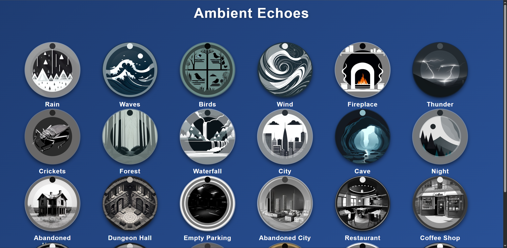

# Ambient Echoes 🌿🎧

**Ambient Echoes** is a visually modern and responsive web app that lets users play and mix ambient sounds such as rain, waves, forest, and more. Designed for relaxation, focus, or sleep, each ambient sound is represented by a circular card with an interactive volume ring styled to match the sound's theme.

## 🌟 Features

- 🎵 24 ambient sounds (Rain, Waves, Birds, Forest, etc.)
- 🔊 Circular volume control around each sound icon
- 🖼️ Themed images for each sound
- 💫 Smooth animations and modern UI
- 📱 Fully responsive
- 🔁 Looping playback for continuous ambiance

## 📸 Preview

 <!-- Replace with actual screenshot filename -->

## 🚀 How to Use

1. Clone or download the repository:
   ```bash
   git clone https://github.com/Jay-pn34/Ambient-Echoes.git
   cd Ambient-Echoes

## 🌐 Live Demo

You can try **Ambient Echoes** live here:  
👉 [https://jay-pn34.github.io/Ambient-Echoes/](https://jay-pn34.github.io/Ambient-Echoes/)
